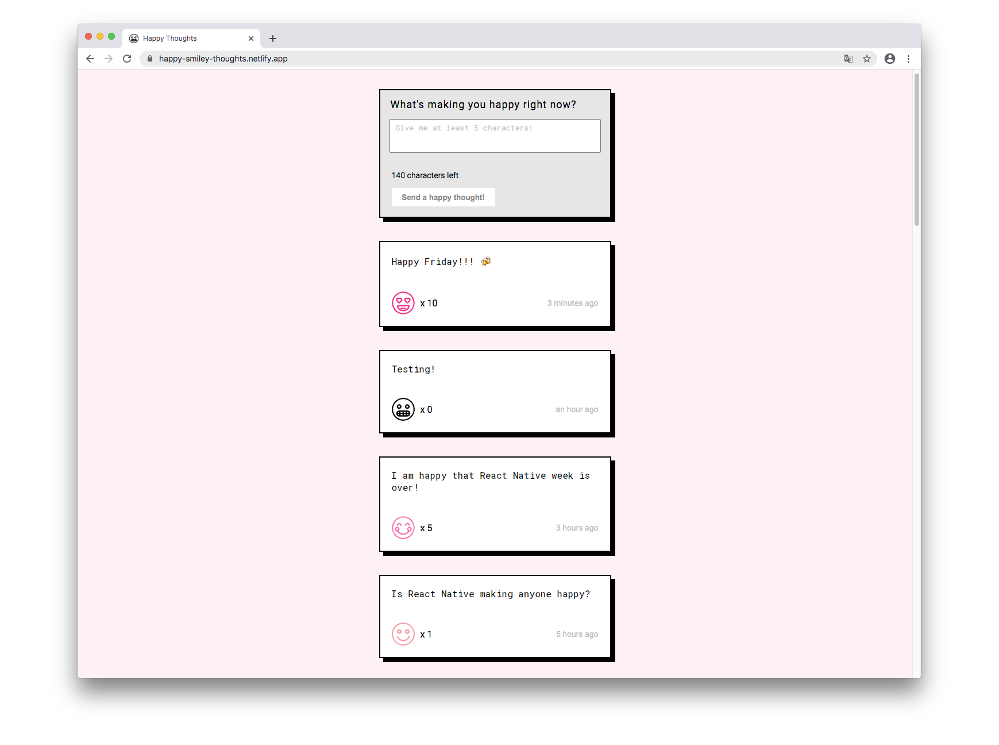

# Happy Thoughts&ensp;|&ensp;[View Live &#10132;](https://happy-smiley-thoughts.netlify.app/)

React site to post happy thoughts, read others and give them likes.

Conditionally renders different styles and elements with the ternary operator e.g. a loading component while fetching the data.
Time codes added using Moment library.

## Core Tech

- React
- useEffect Hook
- useState Hook
- Fetch
- Postman
- CSS3

## Screenshot

## View it live

https://happy-smiley-thoughts.netlify.app/
